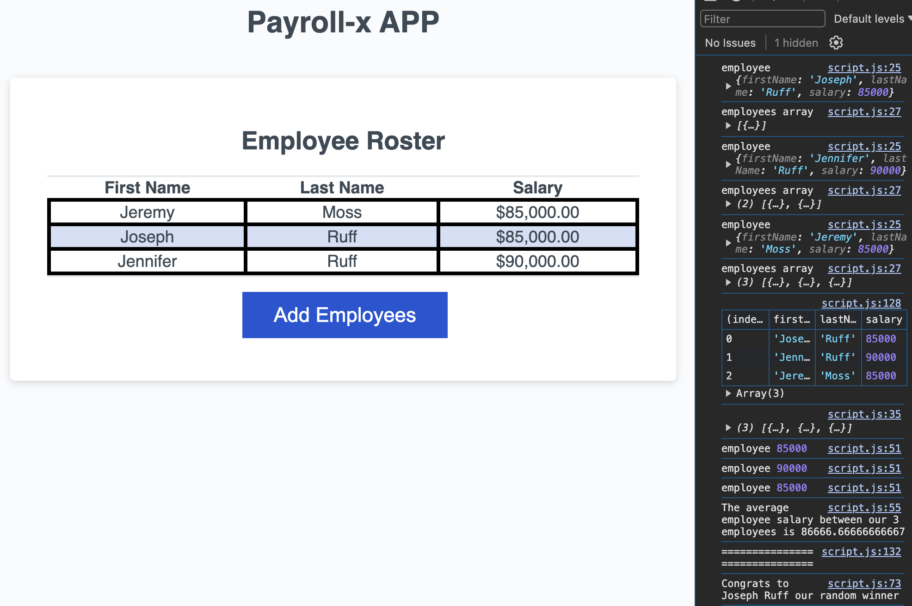

# payroll-x-app
==============

## Description

This is a payroll application that allows you to enter in the first and last name of an employee and their salary. Then the app calculates the average salary. Then the app selects a winning employee at random. 

## Finished Product 

This is my completed payroll-x-app. You can also see in this image what's happening in the console after you enter in the employee name and their salaries:

## Credits

- I used this site to help with JS Basics to understand concepts.
    - **<https://developer.mozilla.org/en-US/docs/Learn/Getting_started_with_the_web/JavaScript_basics>**

## License

MIT see more details in repo

## Live Link

<https://joegruff16.github.io/payroll-x-app/>

## GitHub Repo

<https://github.com/joegruff16/payroll-x-app>